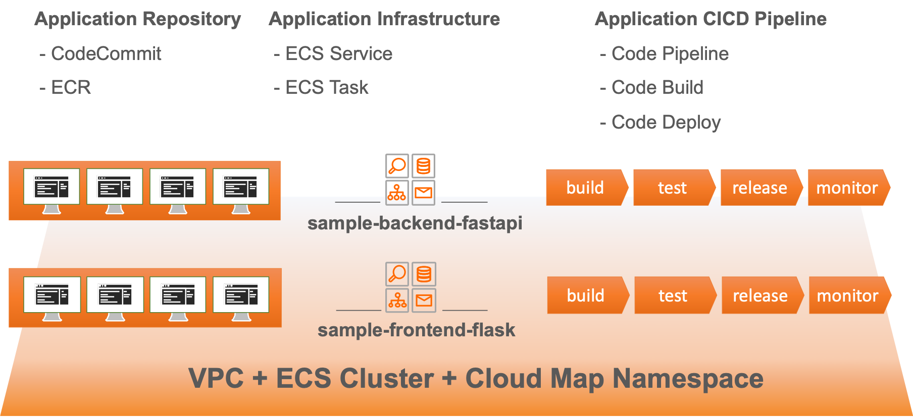
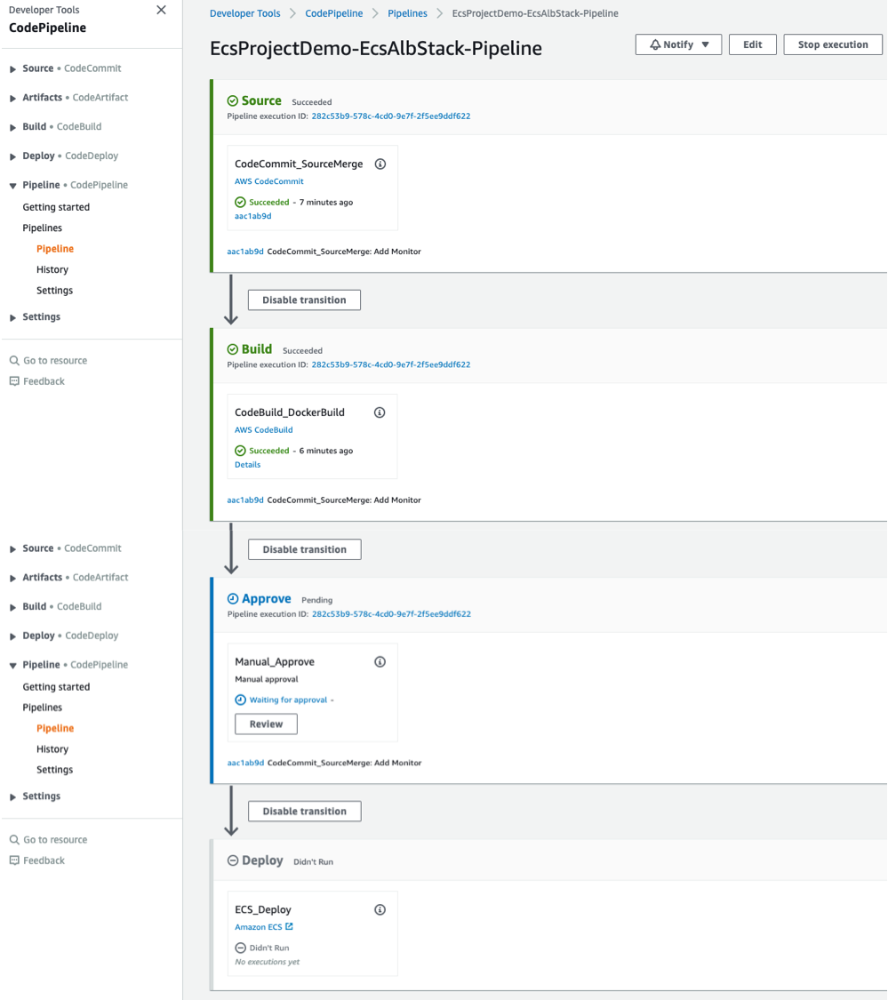
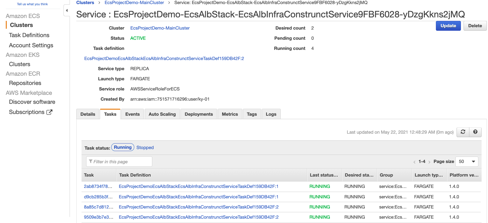
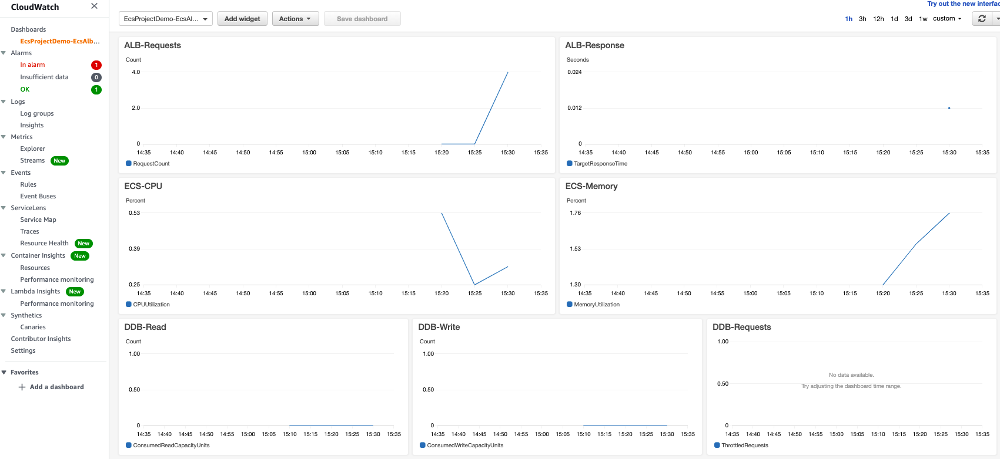

# AWS ECS DevOps using AWS CDK

This repository provides a general DevOps practices such MSA, IaC, CICD and Monitoring. AWS various services are used to provide DevOps best practices. All necessary cloud resources are modeled and deployed through AWS CDK.

Korean Hands on Lab: [AWS-Builders-AWS-CDK-HoL-samples.pdf](https://github.com/aws-samples/aws-ecs-devops-using-aws-cdk/blob/hol_20210624/docs/pdf/AWS-Builders-AWS-CDK-HoL-samples.pdf)

Other "Using AWS CDK" series can be found at:

- ```docs/pdf/AWS-Builders-AWS-CDK-HoL-samples.pdf```

## Solution Architecture

- ***Container-based MSA***: each micro-services are implemented using AWS ECS(Cluster/Service/Task)
- ***Programming-based IaC***: all cloud resources are modeld and provisioned using AWS CDK(Typescript)
- ***Fully managed CICD***: Continuous integration and continuous deploy using AWS Code Series(Pipeline/Commit/Build/Deploy)
- ***Fully managed Monitoring***: logging, metric, dashboard using Amazon CloudWatch
- ***Service Discovery***: private DNS service registration & discovery using AWS Cloud Map


## CDK-Project Build & Deploy

To efficiently define and provision aws cloud resources, [AWS Cloud Development Kit(CDK)](https://aws.amazon.com/cdk) which is an open source software development framework to define your cloud application resources using familiar programming languages is utilized.


Because this solusion is implemented in CDK, we can deploy these cloud resources using CDK CLI. Among the various languages supported, this solution used **typescript**. Because the types of **typescript** are very strict, with the help of auto-completion, **typescript** offers a very nice combination with AWS CDK.

***Caution***: This solution contains not-free tier AWS services. So be careful about the possible costs.

### **Prerequisites**

First of all, AWS Account and IAM User is required. And then the following modules must be installed.

- AWS CLI: aws configure --profile [profile name]
- Node.js: node --version
- AWS CDK: cdk --version
- [jq](https://stedolan.github.io/jq/): jq --version

Please refer to the kind guide in [CDK Workshop](https://cdkworkshop.com/15-prerequisites.html).

### ***Configure AWS Credential***

```bash
aws configure --profile [your-profile] 
AWS Access Key ID [None]: xxxxxx
AWS Secret Access Key [None]:yyyyyyyyyyyyyyyyyyyyyyyyyyyyyy
Default region name [None]: us-east-2 
Default output format [None]: json
    
aws sts get-caller-identity --profile [your-profile]
...
...
{
    "UserId": ".............",
    "Account": "75157*******",
    "Arn": "arn:aws:iam::75157*******:user/[your IAM User ID]"
}
```

### ***Check cdk project's default launch config***

The `cdk.json` file tells CDK Toolkit how to execute your app.

### ***Set up deploy config***

The `config/app-config-demo.json` file describes how to configure deploy condition & stack condition. First of all, change project configurations(Account, Profile are essential) in ```config/app-config-demo.json```.

```json
{
    "Project": {
        "Name": "EcsProject",
        "Stage": "Demo",
        "Account": "75157*******",
        "Region": "us-east-2",
        "Profile": "cdk-demo"
    },
    ...
    ...
}
```

And then set the path of the configuration file through an environment variable.

```bash
export APP_CONFIG=config/app-config-demo.json
```

### ***Install dependecies & Bootstrap***

```bash
sh scripts/setup_initial.sh config/app-config-demo.json
```

### ***Deploy stacks***

Before deployment, check whether all configurations are ready. Please execute the following command.

```bash
cdk list
...
...
==> CDK App-Config File is config/app-config-demo.json, which is from Environment-Variable.
EcsProjectDemo-LoadTesterScriptStack
EcsProjectDemo-SampleBackendFastapiStack
EcsProjectDemo-SampleFrontendFlaskStack
EcsProjectDemo-VpcInfraStack
...
...
```

Check if you can see the list of stacks as shown above.

If there is no problem, finally run the following command.

```bash
sh scripts/deploy_stacks.sh config/app-config-demo.json
```

You can find the deployment results in AWS CloudFormation as shown in the following picture.


Open a web-browser and enter LoadBalancer's domain name(which is the output of ```sh scripts/deploy_stacks```) to see the following screen. or You can find that in AWS CloudFormation.

```bash
...
...
Outputs:
EcsProjectDemo-EcsAlbStack.EcsAlbInfraConstrunctServiceLoadBalancerDNSF445CBCD = EcsPr-EcsAl-1TNJ82PAWJ4IV-1937786873.us-east-2.elb.amazonaws.com
EcsProjectDemo-EcsAlbStack.EcsAlbInfraConstrunctServiceServiceURL290953F6 = http://EcsPr-EcsAl-1TNJ82PAWJ4IV-1937786873.us-east-2.elb.amazonaws.com
...
...
```


The initial web page is a php sample screen(in public DockerHub) as we haven't uploaded the source code yet.


These stacks finally deploy the following resources.

 - EcsProjectDemo-VpcInfraStack: VPC, ECS Cluster, Cloud Map Namespace
 - EcsProjectDemo-SampleBackendFastapiStack: CodeCommit, ECR, ECS Service/Task, Dashboard, CICD Pipeline for **sample-backend-fastapi**
 - EcsProjectDemo-SampleFrontendFlaskStack: CodeCommit, ECR, ECS Service/Task, Dashboard, CICD Pipeline for **sample-frontend-flask**
 - EcsProjectDemo-LoadTesterScriptStack: ECS Service/Task for **load-tester-script**



## How to update logic

AWS CDK created CodeCommit(source repoistory)/ECR(docker repository) repository for you. Please visit CodeCommit in AWS management web console, note remote address of that.


Finally add git remote address in your development environment. Thease codes are sample for you.

```bash
git remote -v
git remote add [your-new-remote-origin-name] [your-codecommit-address]
```

After modifying logic codes(in this repository, logic codes are in ```codes/sample-flask-web```), push only that to AWS CodeCommit. Please commit this directory only, because each micro-servie has its own repository. This will trigger AWS CodePipeline and automatically re-deploy the new container image to AWS ECS Service/Task. You have to click ```Review``` button in Approve stage.





***Caution***:  If you have modified this path( ```codes/sample-flask-web```), please reflect the changed path in ```config/app-config-demo.son``` file.

```json
...
...
    "EcsAlb": {
        "Name": "EcsAlbStack",

        "InfraVersion": "'1.0.0'",

        "PortNumber": 80,
        "AppPath": "codes/sample-flask-web", <------ Here

        "RepoName": "sample-flask-web",

        "DashboardName": "SampleFlaskWeb"
    },
...
...
```

After provisioning, you can check the updated web page like the following screen.


Also you can check a realtime dashboard of cloud resources in Amazon CloudWatch Dashboard.



## How to add a new service

Just add a new stack configuration in ```config/app-config-demo.json```.

And then instantiate ```Class``` like the following codes. 

Since AWS CDK(Typescript, Java, Python, ...) supports object-oriented programming language, you can create a new resource simply by instantiating the object without copying the code. This is one of the great advantages of AWS CDK.

## CDK Useful commands

* `npm install`     install dependencies
* `cdk list`        list up stacks
* `cdk deploy`      deploy this stack to your default AWS account/region
* `cdk diff`        compare deployed stack with current state
* `cdk synth`       emits the synthesized CloudFormation template

## How to clean up

Execute the following command, which will destroy all resources except ECR-Repository and DynamoDB Tables. So destroy these resources in AWS web console manually.

```bash
sh ./script/destroy_stacks.sh config/app-config-demo.json
```

## Security

See [CONTRIBUTING](CONTRIBUTING.md#security-issue-notifications) for more information.

## License Summary

The documentation is made available under the Creative Commons Attribution-ShareAlike 4.0 International License. See the LICENSE file.

The sample code within this documentation is made available under the MIT-0 license. See the LICENSE-SAMPLECODE file.
