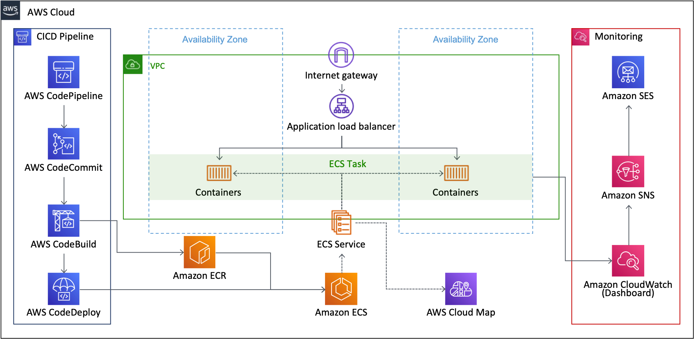

# AWS ECS DevOps using AWS CDK

This repository provides DevOps practices necessary to develop applications based on Amazon Elastic Container Service(ECS) container. Various AWS services are used to support DevOps best practices such as MSA, IaC, CICD, Monitoring and Configuration Management. All necessary cloud resources are modeled and deployed through AWS Cloud Development Kit(CDK). Because AWS CDK abstracts AWS cloud resources as much as possible, we can use it to accelerate DevOps.

Korean `Hands on Lab` Guide: [AWS-Builders-AWS-CDK-HoL-samples.pdf](https://github.com/aws-samples/aws-ecs-devops-using-aws-cdk/blob/hol_20210624/docs/pdf/AWS-Builders-AWS-CDK-HoL-samples.pdf)

 The basic structure of this CDK project is derived from the following project. Check out the repository for best practices for organizing CD projects.

 - [aws-cdk-project-template-for-devops](https://github.com/aws-samples/aws-cdk-project-template-for-devops)

Other "Using AWS CDK" series can be found at:

- [AWS Serverless Using AWS CDK](https://github.com/aws-samples/aws-serverless-using-aws-cdk)
- [Amazon SageMaker Model Serving Using AWS CDK](https://github.com/aws-samples/amazon-sagemaker-model-serving-using-aws-cdk)
- [AWS IoT Greengrass Ver2 using AWS CDK](https://github.com/aws-samples/aws-iot-greengrass-v2-using-aws-cdk)
- [Amazon SageMaker Built-in Algorithms MLOps Pipeline Using AWS CDK](https://github.com/aws-samples/amazon-sagemaker-built-in-algorithms-mlops-pipeline-using-aws-cdk)

## Solution Key Concept

  DevOps encourages various practices to increase development productivity and speed deployment. Representative practies are:

- **MSA(Micro-service Architecture)** as a architecture style
- **IaC(Infrastructure as Code)** as a way to deal with infrastructure
- **CICD(Continuous Integration Continuous Deploy) Pipeline** as a SCM & deployment automation
- **Monitoring Dashboard** as a status/usage monitoring
- **Configuration Management** for maintaining a strict separation of configuration from code

### Common DevOps Scenario

A small number of DevOps team(engineers) should be able to provide the following environments(tool/service/infra) easily and quickly and scalably to each service team. At the same time, they must have ownership of the common areas and resources of each service. Conversely, service team(developers) should be able to focus on developing business logic.

After they(DevOps engineer & Service developer) hold a new service development meeting, DevOps team configures the entire environment(tool/service/infra) and delivers the service development project's Git repository to the service development team, where the service development team develops business logic. Ultimately, they tune cloud resources through monitoring together.


These are the essential elements that each micro-service development team must have for MSA. This repository abstracts these functions through programmable CDK and provides them through CloudFormation/CDK `Stack`. In other words, CDK serves as a tool to make the most of these best practices.


## Solution Architecture

- **Container-based MSA**: each micro-services are implemented using AWS ECS(Cluster/Service/Task)
- **Programming-based IaC**: all cloud resources are modeld and provisioned using AWS CDK(Typescript)
- **Fully managed CICD**: Continuous integration and continuous deploy using AWS Code Series(Pipeline/Commit/Build/Deploy)
- **Fully managed Monitoring**: logging, metric, dashboard using Amazon CloudWatch
- **Service Discovery**: private DNS service registration & discovery using AWS Cloud Map



## CDK-Project Build & Deploy

To efficiently define and provision AWS cloud resources, [AWS Cloud Development Kit(CDK)](https://aws.amazon.com/cdk) which is an open source software development framework to define your cloud application resources using familiar programming languages is utilized.


Because this solusion is implemented in CDK, we can deploy these cloud resources using CDK CLI. Among the various languages supported, this solution used **typescript**. Because the types of **typescript** are very strict, with the help of auto-completion, **typescript** offers a very nice combination with AWS CDK.

### ***CDK Useful commands***

- `npm install`     install dependencies
- `cdk list`        list up stacks
- `cdk deploy`      deploy this stack to your default AWS account/region
- `cdk diff`        compare deployed stack with current state
- `cdk synth`       emits the synthesized CloudFormation template

### **Prerequisites**

First of all, AWS Account and IAM User is required. And then the following modules must be installed.

- AWS CLI: aws configure --profile [profile name]
- Node.js: node --version
- AWS CDK: cdk --version
- [jq](https://stedolan.github.io/jq/): jq --version

Please refer to the kind guide in [CDK Workshop](https://cdkworkshop.com/15-prerequisites.html).

### ***Configure AWS Credential***

Please configure your AWS credential to grant AWS roles to your develop PC. 

```bash
aws configure --profile [your-profile] 
AWS Access Key ID [None]: xxxxxx
AWS Secret Access Key [None]:yyyyyyyyyyyyyyyyyyyyyyyyyyyyyy
Default region name [None]: ap-southeast-1 
Default output format [None]: json
...
...
```

If you don't know your AWS account information, execute the following commad:

```bash
aws sts get-caller-identity --profile [your-profile]
...
...
{
    "UserId": ".............",
    "Account": "75157*******",
    "Arn": "arn:aws:iam::75157*******:user/[your IAM User ID]"
}
```

### ***Check CDK project's launch config***

The `cdk.json` file tells CDK Toolkit how to execute your app. Our current entry point for our project is `infra/app-main.ts`.

### ***Set up deploy config***

The `config/app-config-demo.json` file describes how to configure deploy condition & stack condition. First of all, change project configurations(Account, Profile are essential) in ```config/app-config-demo.json```.

```json
{
    "Project": {
        "Name": "EcsProject",
        "Stage": "Demo",
        "Account": "75157*******",
        "Region": "ap-southeast-1",
        "Profile": "cdk-demo"
    },
    ...
    ...
}
```

And then set the path of the configuration file through an environment variable.

```bash
export APP_CONFIG=config/app-config-demo.json
```

### ***Install dependecies & bootstrap***

```bash
sh scripts/setup_initial.sh config/app-config-demo.json
```

### ***Deploy stacks***

This project has 4 stacks, each of which does the following:

- EcsProjectDemo-VpcInfraStack: VPC, ECS Cluster, CloudMap Namespace for a base infrastructure
- EcsProjectDemo-SampleBackendFastapiStack: Private ALB, ECS Service/Task, ECR/CodeCommit, DDB Table, CodePipeline/Build, CloudWatch Dashboard for Backend
- EcsProjectDemo-SampleFrontendFlaskStack: Public ALB, ECS Service/Task, ECR/CodeCommit, DDB Table, CodePipeline/Build, CloudWatch Dashboard for Frontend
- EcsProjectDemo-LoadTesterScriptStack: ECS Service/Task for internal-testing


`config/app-config-demo.json` file describes how to configure each stack. For example `backend`'s configuration is like this.

```json
...
...
"SampleBackendFastapi": {
    "Name": "SampleBackendFastapiStack",
    "InfraVersion": "'1.0.0'",
    "DockerImageType": "HUB",
    "DockerImageType-Desc": "HUB or ECR or LOCAL",
    
    "PortNumber": 80,
    "InternetFacing": false,
    
    "AppPath": "codes/sample-backend-fastapi",
    "DesiredTasks": 1,
    "Cpu": 256,
    "Memory": 512,

    "AutoScalingEnable": false,
    "AutoScalingMinCapacity": 1,
    "AutoScalingMaxCapacity": 2,
    "AutoScalingTargetInvocation": 50,

    "TableName": "LogTable",

    "AlarmThreshold": 200,
    "SubscriptionEmails": ["kwonyul@amazon.com"]
},
...
...
```

And `frontend`'s configuration is like this.

```json
...
...
"SampleFrontendFlask": {
    "Name": "SampleFrontendFlaskStack",
    "InfraVersion": "'1.0.0'",
    "DockerImageType": "HUB",
    "DockerImageType-Desc": "HUB or ECR or LOCAL",
    
    "PortNumber": 80,
    "InternetFacing": true,

    "TargetStack": "SampleBackendFastapiStack",
    
    "AppPath": "codes/sample-frontend-flask",
    "DesiredTasks": 1,
    "Cpu": 256,
    "Memory": 512,

    "AutoScalingEnable": false,
    "AutoScalingMinCapacity": 1,
    "AutoScalingMaxCapacity": 2,
    "AutoScalingTargetInvocation": 50,

    "AlarmThreshold": 200,
    "SubscriptionEmails": ["kwonyul@amazon.com"]
},
...
...
```

This repository uses python-based containers for convenience only, but you can replace python-based sample stacks with your own container-based stacks later.

Before deployment, check whether all configurations are ready. Please execute the following command:

```bash
cdk list
...
...
==> CDK App-Config File is config/app-config-demo.json, which is from Environment-Variable.
EcsProjectDemo-LoadTesterScriptStack
EcsProjectDemo-SampleBackendFastapiStack
EcsProjectDemo-SampleFrontendFlaskStack
EcsProjectDemo-VpcInfraStack
...
...
```

Check if you can see a list of stacks as shown above.

If there is no problem, finally run the following command:

```bash
sh scripts/deploy_stacks.sh config/app-config-demo.json
```

***Caution***: This solution contains not-free tier AWS services. So be careful about the possible costs.

It is typically DevOps engineer's job to deploy these stacks. After deploying these stacks, DevOps engineers need to pass the repository address(CodeCommit name/address) so that service developers can develop their logic in their repository.

Now you can find deployment results in AWS CloudFormation as shown in the following picture.


## How to test

### ***Frontend Test***

Because frontend is provided through public ALB(LoadBalancer's domain name is the output of ```sh scripts/deploy_stacks```), we can connect frontend using web browser.

```bash
...
...
Outputs:
EcsProjectDemo-EcsAlbStack.EcsAlbInfraConstrunctServiceLoadBalancerDNSF445CBCD = EcsPr-EcsAl-1TNJ82PAWJ4IV-1937786873.ap-southeast-1.elb.amazonaws.com
EcsProjectDemo-EcsAlbStack.EcsAlbInfraConstrunctServiceServiceURL290953F6 = http://EcsPr-EcsAl-1TNJ82PAWJ4IV-1937786873.ap-southeast-1.elb.amazonaws.com
...
...
```


The initial web page is a php sample screen(in public DockerHub) as frontend service team haven't uploaded their source code yet.


And CloudWatch's dashboard provides the current monitoring status like this.


### ***Backend Test***

Because backend is provided through private ALB, we can not use web browser. `LoadTesterScriptStack` was provided for testing that internally in VPC, which is sending a lot of requests within the same VPC. `codes/load-tester-script/app/entrypoint.sh` file describes how to work in docker container, where two types of URL(URL_
ALB, URL_NAMESPACE) are utilized like this.

```bash
#!/bin/sh

echo --TARGET-URL--
export URL_ALB=http://$AlbDnsName/items
export URL_NAMESPACE=http://$TargetServiceName.$Namespace/items
echo "URL_ALB>> $URL_ALB"
echo "URL_NAMESPACE>> $URL_NAMESPACE"


function ab_function {
    echo --ALB-RESPONSE-TEST--
    curl -X GET $URL_ALB
    ab -n 50 -c 2 $URL_ALB

    echo --NS-RESPONSE-TEST--
    curl -X GET $URL_NAMESPACE
    ab -n 50 -c 2 $URL_NAMESPACE

}

echo --START-LOAD-TEST--
while true; do ab_function; sleep 10; done
```

And CloudWatch's dashboard provides the current monitoring status like this.


***Caution***: Because the current DDB table's capacity is very low, `RequestCount` is also low. The answer to this can be found through below graph. That is, DDB table's throttle metric continued to occur and the backend could not respond quickly, resulting in low TPS.


## How to update frontend/backend

### ***DevOps Team(Engineers)***

 DevOps team(engineers) created CodeCommit(source repoistory)/ECR(docker repository) repository throught AWS CDK's stacks. Please visit CodeCommit in AWS management web console, note the repository address in CodeCommit and share it with backend developers and frontend developers.


### ***Service Team(Developers)***

 When frontend/backend service team(developers) receives the Git address, they clone each address and start developing the project. When each developer commit and puth to Git, CICD pipeline is triggered.

For example, backend service developer's project looks like this, where `code/sample-backend-fastapi` path must match `AppPath` in `app-config-demo.json`.


For example, frontend service developer's project looks like this, where `code/sample-frontend-flaskweb` path must match `AppPath` in `app-config-demo.json`.


For convenience, I have prepared sample codes in `codes/sample-backend-fastapi` and `codes/sample-frontend-flask` path, but actually these codes should be managed in separate repositories.

Once CodePipeline starts, this builds each docker image, and push it to ECR, and wait for `Review` button to be clicked on `ECS Deployments`.

CodePipeline is in `In Process`.


CodePipeline is waiting for `Review` button to be clicked.


After provisioning, you can check the updated web page like the following screen.


## How to update infrastructure

After the business logic of each service is deployed through ECR, each stack's configuration must be changed so that the infrastructure deployment also refers to ECR.

Just change `DockerImageType` from `HUB` to `ECR` in each stack configuration below.

```json
"SampleBackendFastapi": {
    "Name": "SampleBackendFastapiStack",
    ...
    ...
    "DockerImageType": "HUB", <----- ECR
    "DockerImageType-Desc": "HUB or ECR or LOCAL",
    ...
    ...
},
```

## How to add a new service

Just add a new stack configuration in ```config/app-config-demo.json```. And then instantiate `EcsAlbServiceStack` in `infra/app-main.ts` with the new stack configuration.

For example, if your new stack is named `UserBackendSpringStack`, you can work in pairs like this:

### ***configuration in `config/app-config-demo.json`***

```json
...
...
"UserBackendSpring": {
    "Name": "UserBackendSpringStack",
    "InfraVersion": "'1.0.0'",
    "DockerImageType": "HUB",
    "DockerImageType-Desc": "HUB or ECR or LOCAL",
    
    "PortNumber": 80,
    "InternetFacing": false,
    
    "AppPath": "codes/user-backend-spring",
    "DesiredTasks": 1,
    "Cpu": 1024,
    "Memory": 2048,

    "AutoScalingEnable": false,
    "AutoScalingMinCapacity": 1,
    "AutoScalingMaxCapacity": 2,
    "AutoScalingTargetInvocation": 50,

    "TableName": "LogTable",

    "AlarmThreshold": 200,
    "SubscriptionEmails": ["kwonyul@amazon.com"]
},
...
...
```

### ***instantiation in `infra/app-main.ts`***

```typescript
...
...
new EcsAlbServiceStack(appContext, appContext.appConfig.Stack.UserBackendSpring);
...
...
```

Since `EcsAlbServiceStack` abstracts each service(CodeCommit, ECR, ECS Service/Task, Dashboard, CICD Pipeline), everything can be automated by instantiating objects with proper configuration. This is one of the great advantages of AWS CDK.

## How to extend service

If you want to change or extend the functionality for `EcsAlbServiceStack`, define a new class that inherits from `EcsAlbServiceStack`.

For example, if you want to replace the database from DDB table to RDS database, this is the right situation.

## How to clean up

Execute the following command, which will destroy all resources except ECR-Repository and DynamoDB Tables. So destroy these resources in AWS web console manually.

```bash
sh ./script/destroy_stacks.sh config/app-config-demo.json
```

In particular, `LoadTesterScriptStack` is currently under load-testing and should be deleted as soon as possible like this.

```bash
cdk destroy *LoadTesterScriptStack --profile [optional: your-profile-name]
```

## Security

See [CONTRIBUTING](CONTRIBUTING.md#security-issue-notifications) for more information.

## License Summary

The documentation is made available under the Creative Commons Attribution-ShareAlike 4.0 International License. See the LICENSE file.

The sample code within this documentation is made available under the MIT-0 license. See the LICENSE-SAMPLECODE file.
